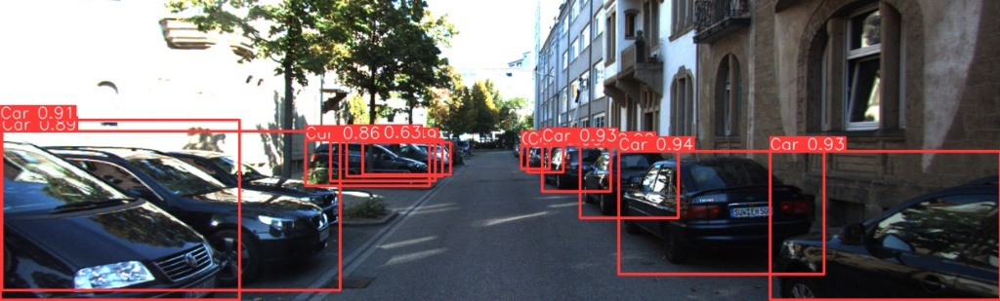

# 🚗 Real-Time Object Detection System for Autonomous Vehicles

[](https://www.python.org/)
[](https://github.com/ultralytics/ultralytics)
[](https://pytorch.org/)
[](LICENSE)
[]()

> A complete autonomous driving perception pipeline — from raw dataset merging to real-time inference — detecting **57 classes** at **60+ FPS** on an RTX 4060.

---

## 📌 Overview

This project builds a full perception system for autonomous vehicles using **YOLOv8s**, trained on a unified ~30GB dataset merged from three industry-standard sources. The pipeline covers everything: dataset analysis, format conversion, merging, training, and real-time inference via webcam or video.

### 🎯 Detection Capabilities

| Category | Classes | IDs | Examples |
|---|---|---|---|
| 🚗 Vehicles (KITTI) | 8 | 0–7 | Car, Van, Truck, Pedestrian, Cyclist, Tram |
| 🛑 Traffic Signs (GTSRB) | 43 | 8–50 | Speed limits (20–120), Stop, Yield, Warnings |
| 🚦 Traffic Lights (LISA) | 6 | 51–56 | Red, Yellow, Green + Left Arrows |
| **Total** | **57** | **0–56** | |

---

## 📊 Model Performance

| Metric | Value |
|---|---|
| Base Model | YOLOv8s (Small, ~11M parameters) |
| Training Epochs | 50 |
| Batch Size | 32 |
| Image Size | 640×640 |
| Optimizer | AdamW |
| **mAP50** | **0.787** (~79% across all 57 classes) |
| **Inference Speed** | **60+ FPS** on RTX 4060 (8GB) |

---

## 🎬 Demo

| Video Inference | Image Detection |
|---|---|
| <video src="assets/Demo.mp4" width="100%" controls></video> |  |

---

## 📁 Repository Structure

```
Real-Time-Object-Detection-System-for-Autonomous-Vehicles/
│
├── assets/                          # Demo video and result screenshots
├── ultimate_overnight/              # Training runs and validation                 

├── Full Project (Merging datasets, Training...).ipynb  # Complete pipeline notebook
├── best.pt                          # Final trained weights (49.7 MB) 
├── .gitignore
└── README.md
```

---

## 📦 Dataset Architecture

Three datasets are merged into a single unified YOLO format (~30GB total). Scripts to download and convert them automatically are included in the notebook.

| Dataset | Task | Classes | Size |
|---|---|---|---|
| [KITTI Vision Benchmark](http://www.cvlibs.net/datasets/kitti/) | Vehicle & pedestrian detection | 8 | ~15GB |
| [GTSRB](https://benchmark.ini.rub.de/) | German traffic sign recognition | 43 | ~10GB |
| [LISA Traffic Light Dataset](https://www.kaggle.com/datasets/mbornoe/lisa-traffic-light-dataset) | Traffic light state detection | 6 | ~5GB |

> ⚠️ The combined dataset is **not included** in this repository due to its size. Use the notebook cells to download and prepare it automatically.

### Dataset Split

| Split | Ratio |
|---|---|
| Train | ~70% |
| Val | ~15% |
| Test | ~15% |

---

## 🚀 Quick Start

### 1. Clone the Repository

```bash
git clone https://github.com/YourUsername/Real-Time-Object-Detection-System-for-Autonomous-Vehicles-.git
cd Real-Time-Object-Detection-System-for-Autonomous-Vehicles-
```

### 2. Install Dependencies

Requires **Python 3.8+**.

```bash
pip install ultralytics torch torchvision opencv-python pandas scikit-learn jupyter tqdm
```

> 💡 For GPU support, install the CUDA-compatible PyTorch build from [pytorch.org](https://pytorch.org/get-started/locally/) **before** running the above command.

Verify your GPU is available:
```bash
python -c "import torch; print('GPU:', torch.cuda.get_device_name(0) if torch.cuda.is_available() else 'Not found')"
```

---

## 🔍 Usage

### Run Inference on an Image

```python
from ultralytics import YOLO

model = YOLO("best.pt")
results = model.predict("your_image.jpg", conf=0.25, save=True)
results[0].show()
```

### Run Inference on a Video

```python
from ultralytics import YOLO

model = YOLO("best.pt")

results = model.predict(
    source="your_video.mp4",
    conf=0.5,
    save=True,
    show_labels=True,
    show_conf=True,
    stream=True
)

for result in results:
    pass  # Streams frame-by-frame
```

### Real-Time Webcam Detection

```python
from ultralytics import YOLO

model = YOLO("best.pt")

# Press 'q' to quit the window
model.predict(source=0, conf=0.25, show=True, stream=True)
```

---

## 🔬 Full Pipeline (Notebook)

Open the notebook to reproduce the entire workflow from scratch:

```bash
jupyter notebook "Full Project (Merging datasets, Training...).ipynb"
```

The notebook is organized into sequential stages:

| Stage | Description |
|---|---|
| 1. Dataset Analysis | Explore LISA folder structure, CSV annotations, image counts |
| 2. LISA Conversion | Convert LISA CSVs → YOLO `.txt` label format |
| 3. Dataset Merge | Combine KITTI + GTSRB + LISA with remapped class IDs |
| 4. Model Training | Train YOLOv8s with AdamW, mosaic augmentation, AMP |
| 5. Sampling & Testing | Test 100–500 samples per dataset with bounding box visualization |
| 6. Video / Webcam | Real-time inference on video files and live webcam feeds |

---

## ⚙️ Training Configuration

```python
model.train(
    data='ultimate_autonomous_dataset/data.yaml',
    epochs=50,
    imgsz=640,
    batch=32,
    optimizer='AdamW',
    lr0=0.001,
    lrf=0.01,
    mosaic=1.0,
    mixup=0.1,
    amp=True,          # Automatic Mixed Precision
    device=0,          # GPU
    workers=4,
)
```

To retrain from scratch, update the `path:` field in `data.yaml` to your local dataset location and run the training cell in the notebook.

---

## 📜 License

This project is licensed under the **MIT License** — see [LICENSE](LICENSE) for details.

The datasets used are subject to their own licenses:
- **KITTI** — [cvlibs.net/datasets/kitti](http://www.cvlibs.net/datasets/kitti/)
- **GTSRB** — [benchmark.ini.rub.de](https://benchmark.ini.rub.de/)
- **LISA** — [Kaggle / UCSD](https://www.kaggle.com/datasets/mbornoe/lisa-traffic-light-dataset)

---

## 🙏 Acknowledgements

- [Ultralytics YOLOv8](https://github.com/ultralytics/ultralytics) — detection framework
- KITTI, GTSRB, and LISA dataset authors — for their contributions to autonomous driving research
- NVIDIA RTX 4060 — for surviving 50 epochs at batch size 32 🔥
